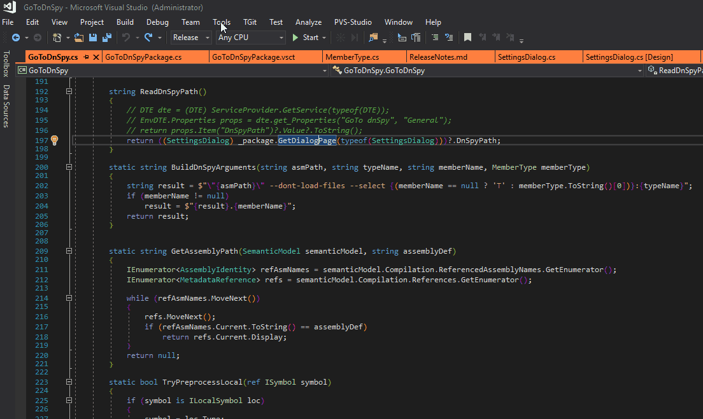
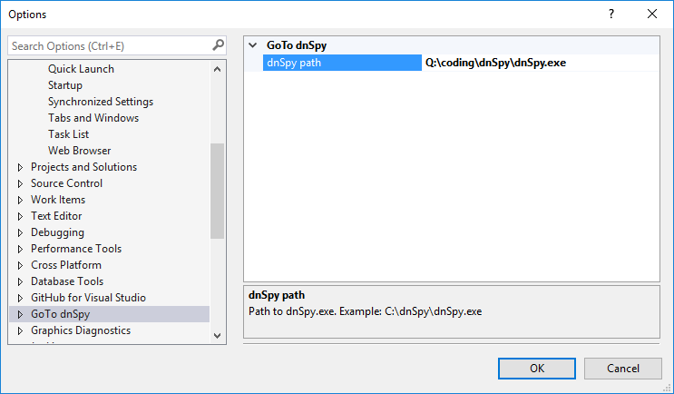

# GoToDnSpy

## Introduction

Sometimes I need something command like Resharper has "Navigate To Decompiled Sources", but I don't want
buy and install it only for this command. So I created this plugin for quick access to dnSpy.

[dnSpy](https://github.com/0xd4d/dnSpy/) is the best tool for .net reseacher.   
You can [download latest dnSpy build](https://ci.appveyor.com/project/0xd4d/dnspy/branch/master/artifacts) from CI.

## Preview

## Options

For work plugin need put path to installed dnSpy in options page.  
You can [download latest dnSpy build](https://ci.appveyor.com/project/0xd4d/dnspy/branch/master/artifacts) from CI.

## Using

Place cursor at referenced code (method, event, etc) and run "GoTo dnSpy..." command.

GoToDnSpy command can be found in Visual Studio tools menu

You can add and use shortcut for fast run command 

