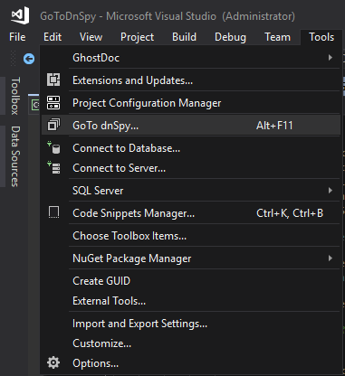

# GoToDnSpy

## Introduction

Sometimes I need something like Resharper command "Navigate To Decompiled Sources", but I don't want to buy and use R# only for this command. So I have created this plugin for quick access to dnSpy or corefx sources.

[dnSpy](https://github.com/0xd4d/dnSpy/) is the best tool for .net reseacher.
You can [download latest dnSpy build](https://ci.appveyor.com/project/0xd4d/dnspy/branch/master/artifacts) from CI.

## Installing

The plugin can be found in [Visual Studio marketplace](https://marketplace.visualstudio.com/items?itemName=VladimirChirikov.GoToDnSpy).

**Please send positive feedback if you like the extension :)**

## Preview

## Options

The plugin needs the path to installed dnSpy on options page.
You can [download latest dnSpy build](https://ci.appveyor.com/project/0xd4d/dnspy/branch/master/artifacts) from CI.

## Using

Place cursor at the code (method, event, etc) and run "GoTo dnSpy..." command.

GoToDnSpy command can be found in Visual Studio tools and right-click context menu.

If this is a runtime libraries code the plugin will run a browser with [source.dot.net](https://source.dot.net).

You can add and use a shortcut to quickly launch the command.

## ISSUES

"is not a valid identifier" errors means that for now plugin can't parse syntax tree under caret, please create issue on github with sample of code, it's help improve extension.
